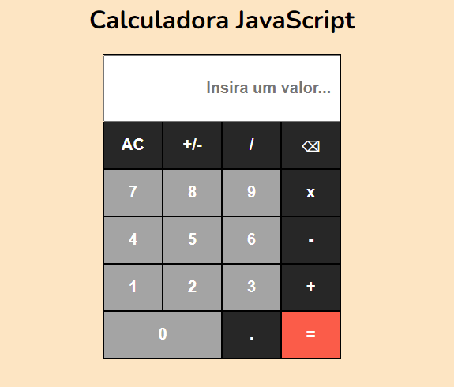

# Calculadora Javascript
Calculadora Javascript criada para o desafio do [AppIdeas](https://github.com/florinpop17/app-ideas).
Veja uma [demo aqui](https://codepen.io/gustavoaqm/pen/gOoEqPV).

**Nível:** 1-Iniciante

As calculadoras não são apenas uma das ferramentas mais úteis disponíveis, mas são
também uma ótima maneira de entender a interface do usuário e o processamento de eventos em um aplicativo. Dentro
este problema você irá criar uma calculadora que suporta aritmética básica
cálculos em números inteiros.

##  Regras

-    [x] O usuário pode ver uma tela mostrando o número atual inserido ou o
resultado da última operação.
-    [x] O usuário pode ver um teclado de entrada contendo botões para os dígitos 0-9,
operações - '+', '-', '/' e '=', um botão 'C' (para limpar) e um 'AC'
botão (para limpar tudo).
-    [x] O usuário pode inserir números como sequências de até 8 dígitos clicando em
dígitos no teclado de entrada. A entrada de qualquer dígito maior que 8 será ignorada.
-    [x] O usuário pode clicar em um botão de operação para exibir o resultado dessa
operação em:
    * o resultado da operação anterior e o último número inserido OU
    * os dois últimos números inseridos OU
    * o último número digitado
-    [x] O usuário pode clicar no botão 'C' para limpar o último número ou o último
Operação. Se a última entrada do usuário foi uma operação, o display será
atualizado para o valor que o precedeu.
-    [x] O usuário pode clicar no botão 'AC' para limpar todas as áreas de trabalho internas e
para definir o visor para 0.

##  Recursos bônus

-    [x] O usuário pode clicar em um botão '+/-' para alterar o sinal do número que está
atualmente exibido.
-    [x] O usuário pode ver um botão de ponto decimal ('.') no teclado de entrada para aquele
permite que números de ponto flutuante de até 3 lugares sejam inseridos e operações para
ser realizado com o número máximo de casas decimais inseridas para qualquer
número.
